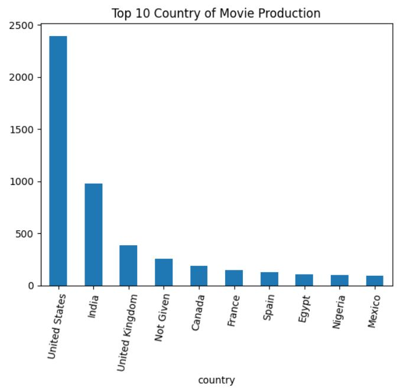
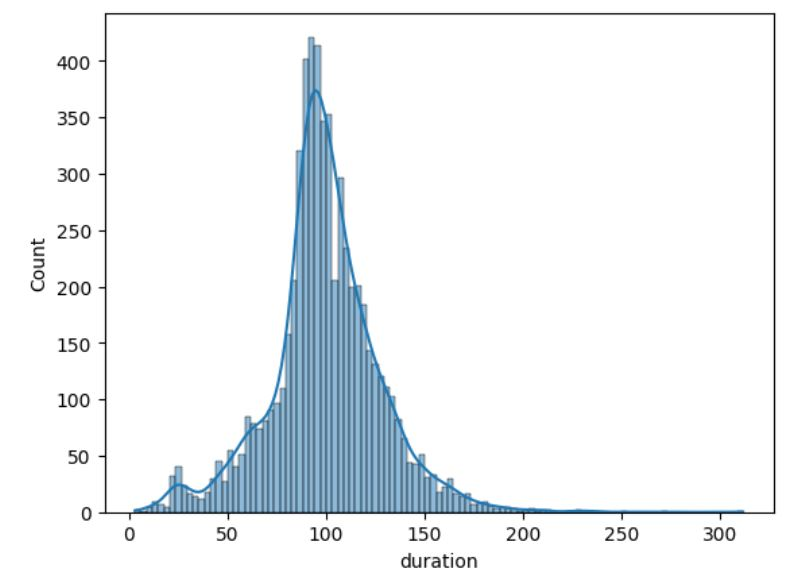
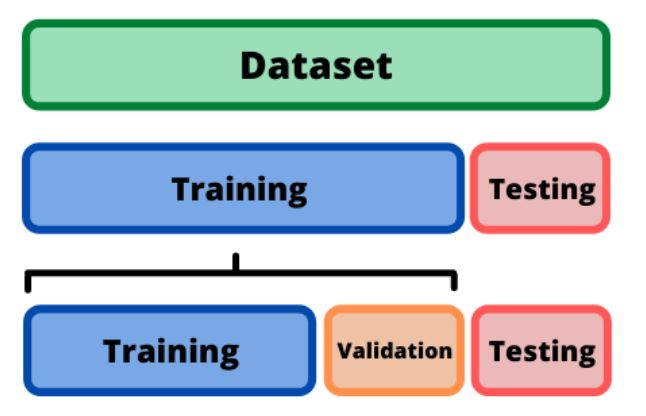
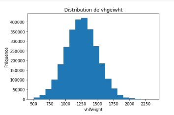

# Data Analyst

#### Technical Skills: Python, R, Excel, VBA, Power BI

### Education
   Statistics and Actuarial Science, Master's Degree | 
   _IRIAF - Institut des Risques Industriels, Assurantiels et Financiers (May 2023)_

  ---
   
   Mathematics and Computer Science Applied to the Humanities and Social Sciences, Bachelor's Degree | 
   _Université de Pau et des Pays de l'Adour (June 2021)_

### Work Experience
**Data Analyst @ Safran Helicopter Engines, Bordes, France (_September 2022 - September 2023_)**
  - Provide visualizations based on the budgetary and temporal data of various projects
  - Act as a database administrator and respond to ticketing requests
  
**Data Analyst @ Safran Helicopter Engines, Tarnos, France (_May 2022 - September 2022_)**
  - Implementation of forecasting tools
  - Automation of management indicators

---

As a Data Analyst, I believe there are 5 important steps in a data project: Data Cleaning, Data Analysis, Data Visualization, Data Engineering, and Communication.

With the projects I was able to do during university as well as my personal projects I tried to cover all these subjects.

---

### Personal Projects
**FIFA 2021**

  

In this project, I had the opportunity to work on a large dataset containing information about players from the FIFA 21 video game. The problem with this dataset is that it contained a lot of errors or difficult data to understand. A major cleaning was necessary if we wanted to use this dataset for more in-depth analysis.

Tasks tackled in this project include:
- Converting data to make it more understandable to a wider audience.
- Formatting certain columns that contained unnecessary characters.
- Creating new variables to make the data clearer.

**NETFLIX DATA**

  

The data provided for this project consisted of the content available on NETFLIX (movies, director names, release dates). By performing simple descriptive statistics and analyses, we can gain a real insight into what is contained in this dataset. Additionally, one interesting aspect of this project is that the data spans over time, allowing us to observe the evolution of certain variables such as the duration of movies or the genres of films.

 | 

**MUSIC PROJECT**

One of the projects I enjoyed working on the most due to its complexity but also because the subject matter was very interesting.

The ultimate goal with this dataset was to associate each piece of music with a music genre using certain variables such as energy, music loudness, and many others.

To achieve this, we had a first dataset for training a classification model and a second dataset for testing this model.

  

### University Projects
**Actuarial Analysis of the AUTO4+ Contract for SAssuranceS**

I had the opportunity to work on a team project within a fictional insurance company, SAssuranceS. Our mission was to conduct an actuarial analysis of the AUTO4+ contract, which insures over a million private vehicles, with a projection over a period of ten years.

Project Objectives:

1. Evaluate the need for a specific provision to anticipate any potential deviation in the technical results of the contract.
2. Provide essential data for drafting actuarial reviews regarding provisioning and pricing of the AUTO4+ contract.
3. Prepare a new pricing proposal incorporating the issues identified during the pricing review.

Focus on the Third Party Collision Damage Guarantee:

The Third Party Collision Damage Guarantee, automatically included in the AUTO4+ contract, was the main focus of our study. We examined claims related to this guarantee, with an emphasis on managing delays and complex claims.

Methods Used:

Descriptive statistics

